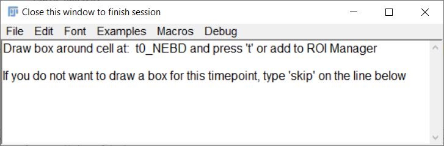
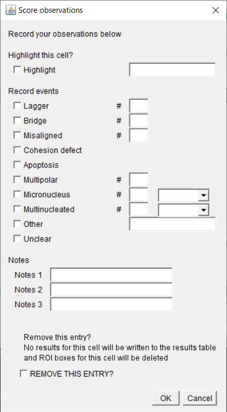

Check [UPDATES](/UPDATES.md) to see what's new

# Mitotic Scoring Macro

This macro helps keeps track of manual scoring of (mitotic) events from movies. It keeps track of timings, position, and potential mitotic errors or events.  
**NOTE:** the macro does NOT automatically track these events from your movies, but facilitates manual scoring.

TLDR: The macro is pretty self-explanatory. Just start working with it and only check here if something is not right.

The main goals of this macro are:
1) minimize clicks and skipping between windows while tracking events
2) keep track of which cells have already been scored
3) avoid loss of progress by regular automatic saving
4) allow for stopping and restarting experiments without losing track of progress
5) to be versatile and allow for easy adaptation to individual experiments without being overly complex   

The macro is pretty uncomplicated and in principle will always tell you what to do. Below is a short explanation of the individual steps anyway.  

## Start macro
[Download](https://github.com/DaniBodor/MitoticScoring/archive/refs/heads/main.zip) this repository by clicking the green 'Code' button above and 'Download ZIP' (or use git pull).

Open the macro by dragging the \*.ijm file into FiJi and clicking 'Run' or hit Ctrl+R.  
Alternatively drop the \*.ijm file into your ImageJ plugins\Analyze folder and select it from _Plugins > Analyze_ dropdown menu 
(requires a restart after you first drop the file there). You can then also create a custom shortcut key via _Plugins > Shortcuts > Add Shortcut..._.

If there is currently no image file open, a window will pop up asking you to open a file.

## Setup
A dialog window will open to ask you for the settings for this experiment. Your settings will be stored as default and loaded the next time you start the macro, so you can just click OK when carrying with an ongoing experiment.

### General settings
- Save location: the path where results will be saved
- Experiment name: this is used for output file naming and for separating between separate analyses
    - if you use same experiment name (and same save location) as a previous experiment, the analysis will continue where you left off
    - if you change either of the above, a new analysis (with new results table and no pre-stored boxes) will start
- Time step: can be any unit; it's just a multiplier for the number of frames between events
### Settings for visual tracking
- how to proceed after drawing a box around your tracked cell ([see below](https://github.com/DaniBodor/MitoticScoring/#step-1-indicate-cell))
    - 'Click OK': draw a box, the click 'OK' on the popup window
    - 'Draw + t': draw a box, then add it to ROI list (for which the default keyboard shortcut is 't')
    - 'Draw only': automatically progress once you drew a box
- the color of the box at the frame you specify as t0, t1, ...
- the color of the box around the cell at all mitotic frames
- on how many Z-planes above and below the drawn boxes to spread the indications
    - set to extremely large number to draw on all Z-planes
- whether or not to duplicate ROIs to the other half of the movie (e.g. useful for movies generated by the [OrgaMovie](https://github.com/DaniBodor/OrgaMovie) macro, where one organoid is displayed twice (left and right) with separate color coding)
### Scoring settings
- Score Observations:
    - 'None': do not keep track of events, only of timings
    - 'Load default': use the [default observation list](https://github.com/DaniBodor/MitoticScoring/#step-2-score-events) for keeping track
    - 'Set new default': you are prompted to choose a custom observation list csv file ([see below](https://github.com/DaniBodor/MitoticScoring/#use-custom-observation-list))
        - the very first time you run the macro, it may prompt you for the file location of the observation list (as below) irrespective of the your choice. Select 'DefaultObservationList.csv' from the folder you downloaded.
- Mitotic stages: choose which stages you want to track.
    - If there is interest in this, I can create a way to customize this list. Alternatively, just choose an unused stage and rename it in your excel file.

## Identify & score mitotic cells
Results are saved after each analyzed cell to avoid losing data after crashes or mistakes. Furthermore, previous progress can be loaded when re-running the macro for the same experiment so that you can stop in the middle of an analysis and carry on another time without losing track of where you were. Also, at any point you can close the current image and open a different (or the same) one without crashing the macro or losing your progress.

### Step 1: indicate cell
The macro will pause and a text window will pop up instructing you to draw a box around the mitotic cell at the for each stage selected in the settings. These boxes are used to visually keep track of which cells have already been analyzed and are saved in your save location after each analyzed cell and automatically reloaded when you restart the macro on the same cell (same experiment name).

Now you can:
- Draw a box around the cell of interest. Depending on your [settings](https://github.com/DaniBodor/MitoticScoring#settings-for-visual-tracking), you do or do not have to add the box to the ROI manager (hit t)
- Type 'SKIP' or 'skip' at the end of the text window to skip the box for any particular stage, and the macro will progress without an entry for this stage
- Close the text wiondow to end the session
- Open a different image and carry on there (if you close all open images while the text window is open, a pop up will appear allowing you to open another image).  

**Pro tip:** If boxes are getting too crowded, it might be useful to create keyboard shortcuts for 'Hide Overlay' and 'Show Overlay'.  
To do this, click on 'Plugins>Shortcuts>Add Shortcut...'. Then select any available Shortcut key and 'Hide Overlay'. Repeat this for  for 'Show Overlay'. Now you can use the assigned shortcut keys to flip on and off the box overlays.

### Step 2: score events
Next, you will be prompted to input observations to track. Any of these can remain empty or be edited at will. Hit OK to progress.

Because ImageJ does not allow for easy undo, I created an option to remove the current entry from your list of observations. **If you turn on "Remove this entry?" the current entry will NOT be written to your results table and the ROIs for this cell will be deleted.** The rest of your results will remain untouched.

There is also an option to mark cells as 'highlighted'. The idea of this is to allow you to easily keep track of cells that you may want to use for a presentation/paper or for whatever other reason want to look back at later on.

**NOTE:** I created a default observation list that I think covers a lot of potential events that you may want to keep track of. Because any of them can remain empty, I think it doesn't matter if not all options are relevant for your experiment. Nevertheless, you can [make a custom observation list](https://github.com/DaniBodor/MitoticScoring/#use-custom-observation-list) if you want to add options, declutter the list, or make a completely different list.

### Step 3: storing and outputting observations
Results will be automatically written to the scoring table and saved (the file is overwritten after each cell) as a \*.csv. This can be read by most downstream applications (Excel, R, Python, Matlab, ...).

### Back to step 1
Wash, rinse, repeat...

## Use custom observation list
It is possible to customize the observation list in a pretty uncomplicated yet versatile way.  
The folder you downloaded should contain a file called 'CustomObservationList.csv', which looks like this (minus the formatting) when opening in Excel:

You can add or remove rows at will and save the file. Then, if you [load it as the new default in the setup](https://github.com/DaniBodor/MitoticScoring#scoring-settings), your custom list will pop up instead of the one I made.

**DO NOT USE COMMAS ANYWHERE IN THIS FILE** (except in the list options as indicated below)

Note that the "Remove this entry?" option will always remain present in the observation list.

### Edit the file as follows
- Type & Event:
    - Specifies the type of entry for your observation list with any text listed under event. 
        - Checkbox: adds a checkbox that can be clicked or unclicked
        - Text: adds a line where any text can be added
        - Number: adds a line where a number can be added. Note that if a non-numerical value is added the macro will either store 'NaN' or potentially crash
        - List: adds a dropdown menu with the [listed options](https://github.com/DaniBodor/MitoticScoring#list-options)
        - File: adds a line with a 'Browse' button where you can put a file location
        - Group: will state the text in 'EVENT' and create a white line to separate the following options from the previous ones. No input is given here.
- Add \#; Add text; Add options:
    - Adds onto the same line, the possibility to add the number (\#) of events of this category, notes (text), or a dropdown list of options. Set to 1 to turn it on or 0 to turn it off. These can be added to any TYPE of line (except Group) and multiple can be on for the same line without problems.
- List options:
    - Create a list of options used for the dropdown menu of List-type lines or when ADD OPTIONS is turned on. Options should be separated by a comma

The file as downloaded would give you the [default list above](https://github.com/DaniBodor/MitoticScoring#step-2-score-events) with some extras to illustrate some of the available options.  
Editing this is simpler than it might seem. Play around for a few minutes and you'll quickly figure it out.

### Current and previous default lists are stored in FiJi.app or ImageJ folder
Your current default observation list is stored, along with all previous defaults, in your FiJi folder. You can restore a prevous default from your local '...\Fiji.app\macros\MitoticScoringDefaults\' folder to see your history of observation lists.

# SubImage Extractor
This macro is intended to create representative or highlighted movies of only an event as scored above.

You will notice that the results file will have a column with an 'extract code'. This extract code is used by the extractor macro to open just the part of the movie that contains just the event highlighted in your results table.

## Setting the extractor
The extract code contains the exact (4D) coordinates of the boxes you made around the event. Using this extractor, you can easily change the coordinates to include more of the movie.

- Movie file: the file location of the movie
- Extract code: copy this from your results table
- Expand box: increases the size of the box in each direction by this many pixels
- Additional timepoints before: starts movie before first indicated timepoint
- Additional timepoints after: ends movie before first indicated timepoint
- Additional slices: get this many Z-planes above and below the extremes of your drawn boxes
    - set this very high to get entire stack
- Swap T and Z: it could happen that the extract code mixes up the T and Z coordinates. If you think this may have happened for your extraction, try turning this on and see what the result looks like  
- All channels will always be included in the extracted image
    - you can turn each on and off in the channels tool

## Licence
This project is licensed under the terms of the [MIT License](/LICENSE.md).

## Citation
Please [cite this project as described here](/CITATION.md).
