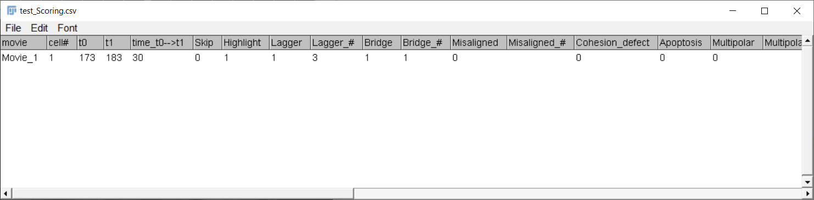

# Mitotic Scoring Macro
This macro helps keeps track of manual scoring of (mitotic) events from movies. It keeps track of timings, position, and potential mitotic errors or events.  
**NOTE:** the macro does NOT automatically track these events from your movies, but facilitates manual scoring.

The main goals of this macro are:
1) minimize clicks and skipping between windows while tracking events
2) keep track of which cells have already been scored
3) avoid loss of progress by regular automatic saving
4) allow for stopping and restarting experiments without losing track of progress
5) to be versatile and allow for easy adaptation to individual experiments without being overly complex  

The macro is pretty uncomplicated and in principle will always tell you what to do.  
Below is a short explanation of the individual steps anyway.  

## Start macro
Download this repository by clicking on the green 'Code' button above and 'Download ZIP' (or use git pull).

Open the macro by dragging the \*.ijm file into FiJi and clicking 'Run' or hit Ctrl+R.  
Alternatively drop the \*.ijm file into your ImageJ plugins\Analyze folder and select it from _Plugins > Analyze_ dropdown menu 
(requires a restart after you first drop the file there).  
You can then also create a custom shortcut key via _Plugins > Shortcuts > Add Shortcut..._.

If there is currently no image file open, a window will pop up asking you to open a file.

## Setup
A dialog window will open to ask you for the settings for this experiment. Your settings will be stored as default and loaded the next time you start the macro, so you can just click OK when carrying with an ongoing experiment.

Here you can set:
- GENERAL SETTINGS:
    - the path where results are saved, your experiment name, and the time step between frames
- SETTINGS FOR VISUAL TRACKING
    - how to proceed after drawing a box around your tracked cell ([see below](https://github.com/DaniBodor/MitoticScoring/#step-1-indicate-cell))
        - 'Click OK': draw a box, the click 'OK' on the popup window
        - 'Draw + t': draw a box, then add it to ROI list (for which the default keyboard shortcut is 't')
        - 'Draw only': automatically progress once you drew a box (no undos are possible, so be careful when clicking around)
    - the color of the box at the frame you specify as t0, t1, ...
    - the color of the box around the cell at all mitotic frames
    - whether or not to duplicate ROIs to the other half of the movie (e.g. useful for movies generated by the [OrgaMovie](https://github.com/DaniBodor/OrgaMovie) macro, where one organoid is displayed twice (left and right) with separate color coding)
- SCORING SETTINGS:
    - 'Score Observations':
        - 'None': do not keep track of events, only of timings
        - 'Load default': use the [default observation](https://github.com/DaniBodor/MitoticScoring/#step-2-score-events) list for keeping track
            - the first time you run the macro, it may prompt you for the file location of the observation list ([see below](https://github.com/DaniBodor/MitoticScoring/#use-custom-observation-list)).
        - 'Set new default': you are prompted to choose a custom observation list csv file ([see below](https://github.com/DaniBodor/MitoticScoring/#use-custom-observation-list)).
    - Mitotic stages: at least one must be selected
    - **NOTE:** A problem would occur in the results table if you run the macro using the same experiment name but a different observation list or set of mitotic stages. If this happens (and you do not abort), the previously existing results table and ROI lists will be renamed and your analysis starts afresh with new settings.

## Identify & score mitotic cells
Results are saved after each analyzed cell to avoid losing data after crashes or mistakes. Furthermore, previous progress can be loaded when re-running the macro for the same experiment so that you can stop in the middle of an analysis and carry on another time without losing track of where you were. Also, at any point you can close the current image and open a different (or the same) one without crashing the macro or losing your progress.

### Step 1: indicate cell
The macro will ask you to draw a box around the mitotic cell at the for each stage selected in the settings. These boxes are used to visually keep track of which cells have already been analyzed.  
These boxes are saved in your save location after each analyzed cell, and are automatically reloaded when you restart the macro on the same cell.

### Step 2: score events
Next, you will be prompted to input observations to track:  

### Step 3: storing and outputting observations
Then, results will be written to the scoring table, which is immediately saved (the file is overwritten after each cell) as a \*.csv, which can be read by most downstream applications (Excel, R, Python, Matlab, ...).

### Back to step 1
It then asks you to identify and box the next cell. This repeats forever, until you hit 'Esc' (a few times) or in some other way quit the macro.

## Use custom observation list
Readme section in development

